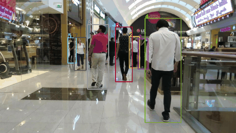
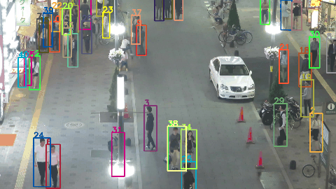

## HDE-Track: Sperm Detection and Tracking Model Using HDE Transformer with Spatio-Temporal Deformable Attention for Sperm Analysis Automation

## Introduction
editing now

## Updates
- update yet

## VISEM-Tracking Evaluation

# Base Tracking Model
If download link is invalid, models and logs are also available in [Github Release](https://github.com/PeizeSun/TransTrack/releases/tag/v0.1) and [Baidu Drive](https://pan.baidu.com/s/1dcHuHUZ9y2s7LEmvtVHZZw) by code m4iv.

#### Notes
- editing now

## Demo
  

## Installation
The codebases are built on top of [Deformable DETR](https://github.com/fundamentalvision/Deformable-DETR) and [CenterTrack](https://github.com/xingyizhou/CenterTrack).

#### Requirements
- Linux, CUDA>=12.4
- Python>=3.10
- PyTorch ≥ 1.5 and [torchvision](https://github.com/pytorch/vision/) that matches the PyTorch installation.
  You can install them together at [pytorch.org](https://pytorch.org) to make sure of this
- OpenCV is optional and needed by demo and visualization

## Citing

memo

